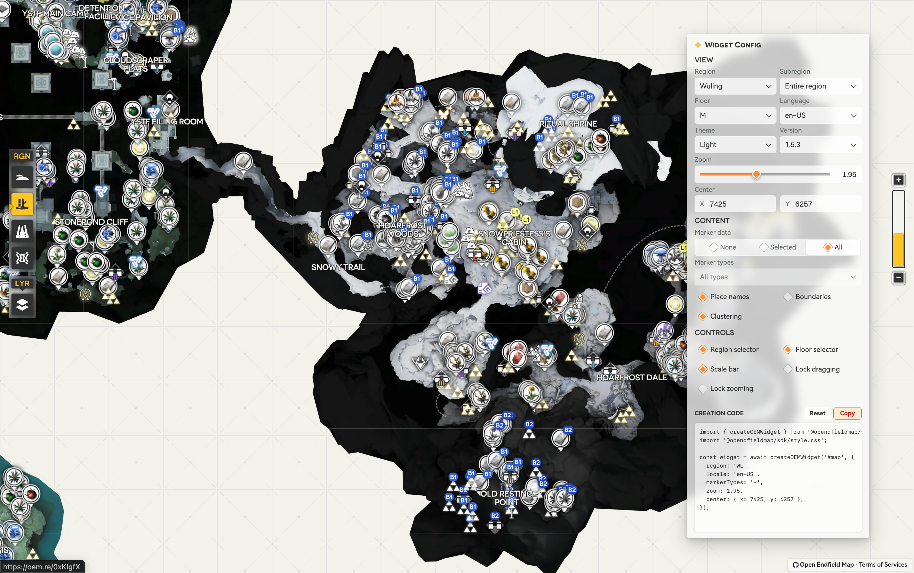

# Open Endfield Map SDK

An embeddable Endfield map for wikis, guides, databases, and companion tools.
The SDK gives a host application a fast, configurable map with markers, labels,
boundaries, region/floor controls, and a small integration surface.

[](https://sdk.opendfieldmap.org/demo/)
[](https://github.com/Terra-Online/OEM-SDK)
[](LICENSE)

Languages: English · [简体中文](docs/README.zh-CN.md) · [繁體中文（香港）](docs/README.zh-HK.md)

## Preview

<!-- Preview slot: save the screenshot as docs/assets/preview.png and uncomment the image below. -->
<!--  -->

The interactive demo is available at [sdk.opendfieldmap.org/demo](https://sdk.opendfieldmap.org/demo/).

## What it provides

- A framework-neutral map renderer with an optional React wrapper.
- Atlos-aligned region and floor controls, marker clustering, scale control, and themes.
- Data-driven marker types, localized labels, subregions, and boundaries.
- Stable tile URLs with per-tile `v` cache keys, so unchanged tiles remain cacheable across data releases.
- Compact `VL`, `WL`, `DJ`, and `ES` region aliases and canonical `oem.re` point links.
- SSR-safe module imports and TypeScript declarations.

The npm packages contain the runtime only. Map data, tiles, labels, marker assets,
and fonts are loaded from the static origin at `https://data.opendfieldmap.org`.

## Install and configure

The primary integration package is `@opendfieldmap/sdk`:

```bash
npm install @opendfieldmap/sdk
```

Give the host element an explicit height, import the stylesheet once, and create
the widget with named options:

```html
<div id="map" style="height: 480px"></div>
```

```ts
import { createOEMWidget } from '@opendfieldmap/sdk';
import '@opendfieldmap/sdk/style.css';

const widget = await createOEMWidget('#map', {
  region: 'VL',
  subregion: null,
  floor: 'M',
  locale: 'en-US',
  markerTypes: ['aurylene', 'crate_i', 'crate_ii', 'crate_iii', 'cratesurprise', 'cratelocked'],
  labels: true,
  boundaries: false,
  markerClustering: true,
});

// Later:
await widget.setOptions({ region: 'WL', markerTypes: ['gather'] });
widget.destroy();
```

All options are optional. Without a custom resource configuration, the SDK
follows `https://data.opendfieldmap.org/channels/stable.json` and automatically
uses the current stable data release. To pin a compatible manifest or use a
self-hosted tree:

```ts
const widget = await createOEMWidget('#map', {
  resources: {
    baseUrl: 'https://maps.example.com',
    manifestPath: '/channels/stable.json',
  },
  region: 'DJ',
  markerTypes: false,
});
```

For React applications:

```bash
npm install @opendfieldmap/react
```

```tsx
import { OEMWidget } from '@opendfieldmap/react';
import '@opendfieldmap/sdk/style.css';

export function MapPanel() {
  return <OEMWidget options={{ region: 'ES', markerTypes: ['crate_i'] }} style={{ height: 480 }} />;
}
```

## Package layout

| Package | Role |
| --- | --- |
| `@opendfieldmap/sdk` | Primary embeddable Widget and standard controls |
| `@opendfieldmap/map` | Lower-level framework-neutral renderer |
| `@opendfieldmap/core` | Manifest schema, resource helpers, coordinates, and point links |
| `@opendfieldmap/react` | React lifecycle wrapper for the Widget |

## Technology

- TypeScript, ESM, and generated declaration files
- Leaflet and `leaflet.markercluster` for map rendering and clustering
- React 18/19 adapter (`@opendfieldmap/react`)
- Sass and Vite for namespaced styles and the demo build
- Cloudflare Pages for the demo application
- Cloudflare R2 for versioned static map resources
- Atlos-compatible assets and typography, with `HMSans_EN` as the global Latin fallback

## Project status

This repository is an early alpha release candidate (`0.1.0-alpha.0`). The demo
is live, the stable static data channel is operational, and npm tarballs can be
generated locally. npm publication is intentionally manual and has not been
performed yet.

The repository is split into two deployable surfaces:

```text
OEM-SDK npm packages       runtime, controls, types, and styles
data.opendfieldmap.org     manifests, markers, labels, fonts, and tiles
sdk.opendfieldmap.org      public SDK demo
```

Static game resources are distributed separately from npm packages and may carry
their own licensing terms. Source code in this repository is AGPL-3.0-only.

## Development

```bash
pnpm install
pnpm dev                 # local HMR demo at http://127.0.0.1:4173/demo/
pnpm build               # build package distributions
pnpm pack:release        # write npm tarballs to artifacts/npm
pnpm build:demo          # build the Pages artifact
```

The demo build is application-only; it does not bundle map tiles or data.

## Links

- [Live SDK demo](https://sdk.opendfieldmap.org/demo/)
- [OEM-SDK source repository](https://github.com/Terra-Online/OEM-SDK)
- [Widget API](docs/api.md) · [简体中文](docs/api.zh-CN.md) · [繁體中文（香港）](docs/api.zh-HK.md)
- [Static resource protocol](docs/cdn-design.md) · [简体中文](docs/cdn-design.zh-CN.md) · [繁體中文（香港）](docs/cdn-design.zh-HK.md)
- [Package and npm release structure](docs/npm-release.md) · [简体中文](docs/npm-release.zh-CN.md) · [繁體中文（香港）](docs/npm-release.zh-HK.md)
- [Terms of Services](https://blog.opendfieldmap.org/docs/tos#intellectual-property-and-copyright)
