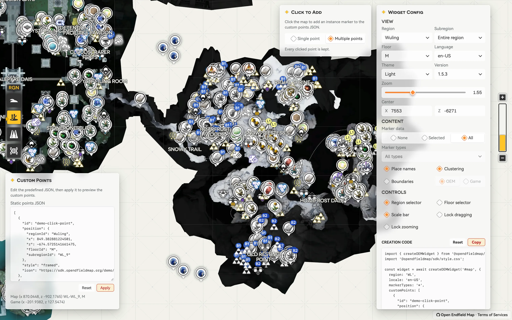

# 终末地地图集（OEM）SDK

[](https://sdk.opendfieldmap.org/demo/)
[](https://github.com/Terra-Online/OEM-SDK)
[](LICENSE)

其他语言版本：[English](../README.md) · 简体中文 · [繁體中文](README.zh-HK.md)

终末地地图集（OEM）SDK 是一个面向《明日方舟：终末地》Wiki、数据库及其他社区工具项目的易集成地图组件。通过开箱即用的集成接口，即可构建功能丰富、可交互的终末地地图，而无需自行维护底层地图瓦片和游戏数据。

依托 [Open Endfield Map](https://github.com/Terra-Online/Atlos)，SDK 可直接使用由我们持续维护的地图源和数据集。历史版本也会与当前数据一并保留，可用于版本差异对比、内容核验、考据和研究。

**一次集成，自動更新，地图维护交给我们。**

## 预览

交互式演示可在 [sdk.opendfieldmap.org/demo](https://sdk.opendfieldmap.org/demo/) 查看。



## 提供能力

- **交互式地图渲染**，支持点位、标签、边界、区域、楼层、聚合、主题和可配置控件。
- **框架无关的集成方式**，并提供一流的 React 支持。
- **带版本的地图源和数据集**，覆盖当前及历史游戏版本。
- **本地化支持**，可在所支持的语言中构建地图内容。
- **由 OEM 基础设施托管的数据与资源分发**。您无需再为地图瓦片和数据采集、更新或托管操心。

多数常用配置都可以在 [**SDK Demo**](https://sdk.opendfieldmap.org/demo) 中直接体验、配置，并会随着配置调整生成可直接使用的集成代码。

对于需要精细控制的应用，OEM SDK 也提供更底层的 API。详见我们的 [Widget API 文档](api.zh-CN.md)。

## 安装与配置

主要入口包为 `@opendfieldmap/sdk`：

```bash
npm install @opendfieldmap/sdk
```

为宿主元素设置明确的高度，导入一次样式文件，然后使用具名选项创建 Widget：

```html
<div id="map" style="height: 480px"></div>
```

```ts
import { createOEMWidget } from '@opendfieldmap/sdk';
import '@opendfieldmap/sdk/style.css';

const widget = await createOEMWidget('#map', {
  region: 'WL',
  locale: 'zh-HK',
  markerTypes: '*',
  zoom: 2,
  center: { x: 7425, y: 6257 },
});

// 后续动作：
await widget.setOptions({ region: 'WL', markerTypes: ['gather'] });
widget.destroy();
```

默认情况下，SDK 会使用由 Open Endfield Map 维护的最新稳定版地图数据。您也可以选择使用具有本 SDK 可识别之 manifest 的自托管资源：

```ts
const widget = await createOEMWidget('#map', {
  resources: {
    baseUrl: 'https://maps.example.com',
    manifestPath: '/channels/stable.json',
  },
  region: 'DJ',
  markerTypes: false,
});
```

对于 React 应用：

```bash
npm install @opendfieldmap/react
```

```tsx
import { OEMWidget } from '@opendfieldmap/react';
import '@opendfieldmap/sdk/style.css';

export function MapPanel() {
  return <OEMWidget options={{ region: 'ES', markerTypes: ['crate_i'] }} style={{ height: 480 }} />;
}
```

## 包结构

| 包 | 用途 |
| --- | --- |
| `@opendfieldmap/sdk` | 主要的嵌入式 Widget 与标准控件 |
| `@opendfieldmap/map` | 更底层、框架无关的地图渲染器 |
| `@opendfieldmap/core` | Manifest schema、资源辅助工具、坐标和点位链接 |
| `@opendfieldmap/react` | Widget 的 React 生命周期封装 |

## 开发

```bash
pnpm install
pnpm dev                 # 本地 HMR 演示：http://127.0.0.1:4173/demo/
pnpm build               # 构建各包发布产物
pnpm pack:release        # 将 npm tarball 写入 artifacts/npm
pnpm build:demo          # 构建 Pages 部署产物
```

Demo 构建仅包含应用本身，不会打包地图瓦片或数据。

## 链接

- [在线 SDK Demo](https://sdk.opendfieldmap.org/demo/)
- [OEM-SDK 源代码仓库](https://github.com/Terra-Online/OEM-SDK)
- [Widget API](api.zh-CN.md) · [English](api.md) · [繁體中文](api.zh-HK.md)
- [静态资源协议](cdn-design.zh-CN.md) · [English](cdn-design.md) · [繁體中文](cdn-design.zh-HK.md)
- [包与 NPM 发布结构](npm-release.zh-CN.md) · [English](npm-release.md) · [繁體中文](npm-release.zh-HK.md)
- [服务条款](https://blog.opendfieldmap.org/docs/tos#intellectual-property-and-copyright)